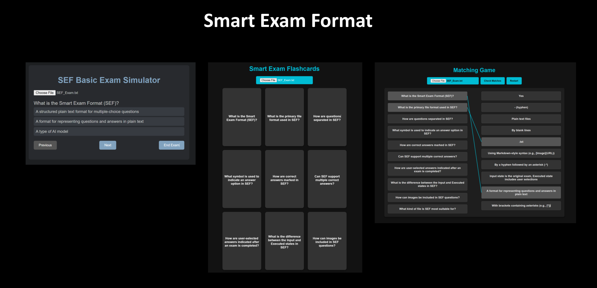

# Smart Exam Format

The **Smart Exam Format (SEF)** offers a practical and innovative way to use plain text `.txt` files for creating exams. SEF is designed to provide diminishing returns and detailed analytics, with formatted sample outputs and AI-generated questions based on exam results. This approach ensures a continuous cycle of learning and improvement. SEF includes several examples of exam simulators, AI prompt outputs that can be pasted into any AI chatbot, and code samples for integrating with popular AI APIs. As a free and open format, SEF can be used and adapted to meet specific needs, making it a valuable tool for learners, educators, and developers.




Explore our samples and exam simulators to see how SEF can transform your learning experience!

## Why Choose Smart Exam Format?

- **Simplicity & Compatibility**: Built on a clean, intuitive, text-based format, SEF is highly readable and easy to use, requiring only a `.txt` file. This makes it seamlessly compatible with any device or platform, allowing hassle-free storage, sharing, and editing.
  
- **Dynamic Two-State Design**: SEF’s **Input State** and **Executed State** are the key to personalized learning. These states track user responses, making it easy to pinpoint areas for improvement. With clear tracking of weaker or missed questions, SEF’s two-state approach offers data-rich feedback for reinforcement.

- **AI-Powered Learning Cycle**: SEF is designed to enable a **learning and reinforcement cycle** with AI. By identifying mistakes in the Executed State, SEF allows AI tools to generate personalized follow-up questions. This continuous cycle of practice and improvement supports learners in building deeper understanding with every session.

- **AI-Optimized for Real-Time Feedback**: Seamlessly integrating with tools like ChatGPT, Copilot, and Google Gemini, SEF empowers AI to create new, customized questions based on individual performance. This reinforcement process adapts dynamically to each learner, resulting in a highly engaging, individualized learning experience.

## Free and Open Format

The Smart Exam Format is **free to use and adapt**. There are no proprietary restrictions or requirements—SEF is simply a format description, designed for open use. Users are encouraged to adapt SEF to fit their unique needs, and we welcome **good ideas and suggestions** on how to enhance it further.

---

## How SEF Compares to Other Exam Formats

### 1. VCE Format
The **VCE format** (.vce) is a proprietary format used primarily by testing software like Vumingo and Avanset, typically for IT certification exams. The VCE format is designed to simulate exam environments, but it relies on paid, proprietary software, which limits flexibility and accessibility. Unlike SEF:
- VCE files require specific software to view and edit, often with a subscription.
- VCE does not offer an open-source or adaptable structure, making it harder to integrate with AI tools.
- SEF, in contrast, is an open, text-based format that allows for greater adaptability and compatibility with AI.

### 2. Aiken Format for Moodle
The **Aiken format** is a popular text-based format for Moodle quiz imports. It allows educators to import multiple-choice questions into Moodle, but it lacks the flexibility of SEF. Key differences include:
- **Simplicity but Limited Features**: Aiken format is simpler but does not track user responses, thus lacking an Executed State for feedback loops.
- **No AI Integration**: The format is not designed for adaptive learning or AI-driven question generation.
- **Use Case Differences**: While Aiken works well for static question imports, SEF provides a continuous cycle of improvement by tracking responses and leveraging AI for follow-up.

### 3. SEF’s Unique Value Proposition
SEF is uniquely designed for continuous learning, providing adaptive feedback through AI analysis. Its plain-text design ensures compatibility and openness, while its two-state structure enables advanced performance tracking and reinforcement, making it ideal for dynamic and adaptive learning environments.

---

## Format Overview

### Questions & Answers

The SEF format handles both questions and user responses with a simple, structured syntax, designed for ease of use and readability.

- **Questions**: Any line not beginning with a hyphen (`-`) or bracket (`[]`) is considered a new question. Images can be included using Markdown syntax, e.g., `[Image](https://example.com/image.png)`.
  
- **Answers**: Each answer starts with a hyphen (`-`). Correct answers are marked with `-*`, and after the exam, user selections are marked `[ * ]`.

### Two States of the Smart Exam Format

SEF is uniquely structured with two distinct states:

1. **Input State (Exam File)**: The initial format, containing questions and correct answers, with no user input or bracket notation (`[]`).
   
2. **Executed State (User Responses)**: Reflects user selections, tracking correct answers and responses. In this state, AI can analyze responses and recommend further learning.

## Sample Format in SEF

**Input State Example:**
```
What is 2 + 2?
-* 4
- 3
- 5
```

**Executed State Example:**
```
What is 2 + 2?
[] -* 4
[] - 3
[*] - 5
```

---

## AI Integration

**Smart Exam Format** is uniquely suited for integration with AI models, enabling enhanced learning through:

- **Question Generation**: AI can create new questions based on previous exam results for targeted, ongoing learning.
- **Result Analysis**: Identify common errors and reinforce weak points.
- **Customizable Prompts for Various AI Models**: In `docs/ai_integration/`, find example prompts and guidance on using AI models like ChatGPT, Copilot, and Google Gemini.

## Folder Structure

- **`src/parsers/`**: Parsing scripts for SEF.
- **`src/exam_simulators/`**: Web/desktop simulators with focus on incorrect answers.
- **`samples/ai_generated_questions/`**: Sample AI-generated questions for learning reinforcement.
- **`analysis/result_analysis/`**: Scripts for analyzing exam performance.
- **`docs/ai_integration/`**: Detailed guides and example prompts for AI integration.

## How to Use

1. Create questions in SEF’s **Input State** format.
2. Use AI tools to generate feedback based on user responses in the **Executed State**.
3. Track improvement through a continuous loop of AI-enhanced practice and reinforcement.

With the **Smart Exam Format**, harness the full potential of AI to create a dynamic, powerful, and engaging cycle of learning. Get started today and explore the next generation of adaptive digital education!

